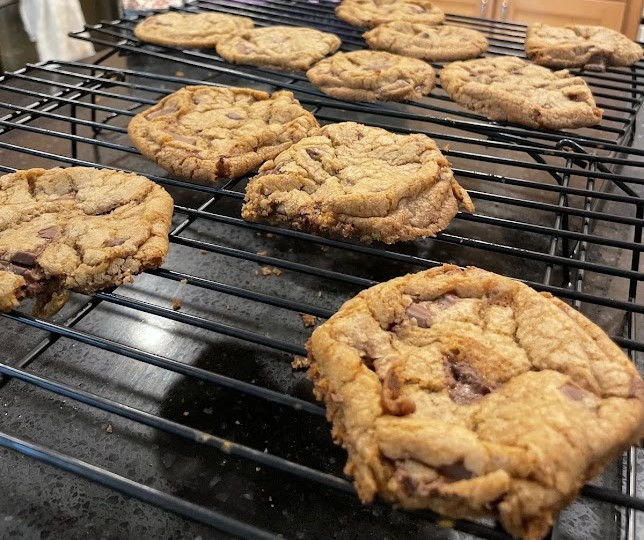
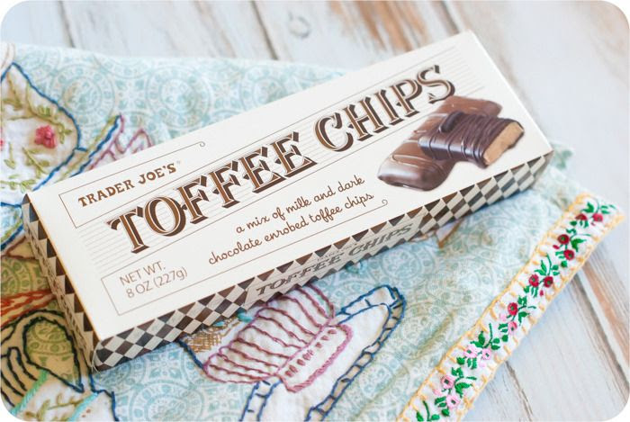
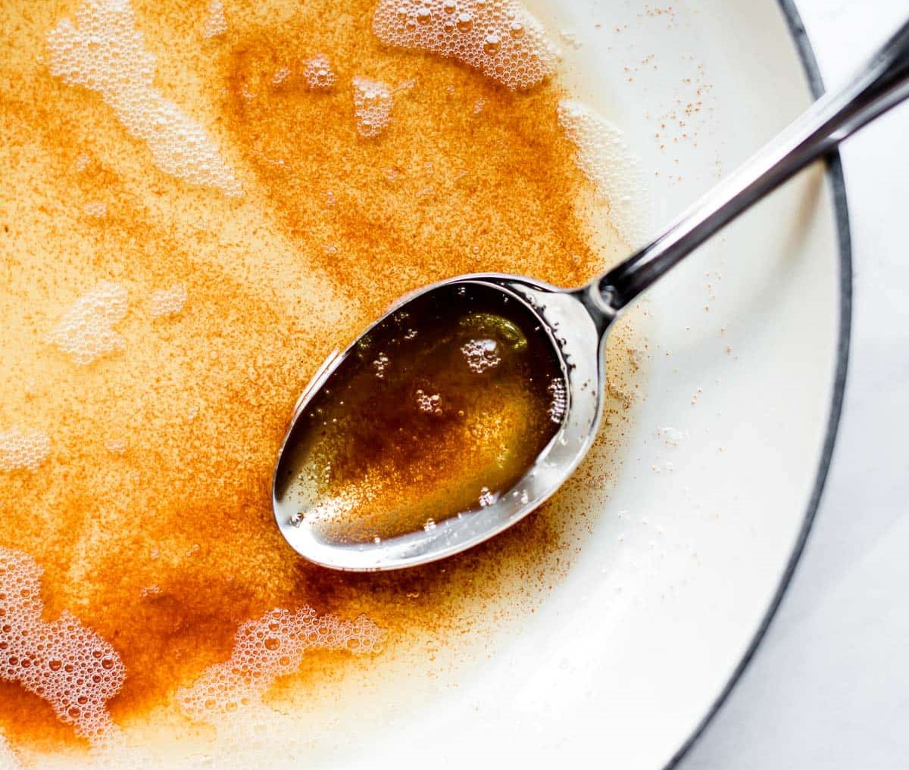

## How to make the best toffee chocolate cookies _Ever_

Full of chocolate and toffee chunks, these cookies are sure to please

Adapted from Addie Shukausky✨

## Ingredients

- 1 stick of butter
- 1/2 cup white sugar
- 3/4 cup brown sugar
- 1 teaspoon salt
- 1/2 teaspoon baking soda
- 1 1/4 cup flour
- 1 egg
- A dash of vanilla extract
- 4 oz Hershey's Chocolate Bar (I usually use an XL Hershey's Bars)
- 4 oz of Toffee Chips 

*Note for the toffee chips:
Typically I use the Trader Joe's Toffee Chips. They can be a bit more on the pricier side but (in my opinion) are totally worth the money. The package comes with both milk and dark chocolate coatings and each recipe only needs half of the box, so I use the different chocolate coatings depending on the sweetness levels I want for my cookies.

# Instructions
1) Brown the stick of butter in a pot on the stove. Let cool for 15 minutes. 
>See below if unsure how to brown butter.
2) While the butter is cooling, coarsely chop the Hershey's Bar and the toffee chips. Set to the side.
2) Mix together the white sugar, brown sugar, salt, and baking soda. Add the butter and dash of vanilla extract and mix well.
3) Add the egg and mix until creamy.
4) Add in the flour 1/4 cup at a time.
6) After dough is fully mixed, add in the chocolate and toffee and combine.
7) Form the dough into balls and let cool in the fridge or freezer. *NOTE: If this step is not completed, the cookies will be very thin and burn on the edges.
8) Set the oven to 350 degrees F and cook for 8-12 minutes. 
9) Let cool and then enjoy your delicious cookies!

# How to Brown Butter
> Browning butter is a great way to add a nutty and bold flavor to your cookies.

To brown your butter, place your stick in a pan with medium heat. The butter will melt and then begin to sizzle. Keep an eye on the butter and keep stirring. Eventually, the butter will separate and look like this, and you'll know your butter is officially browned:

*Note: There is a very fine line between browned butter and burnt butter, so try to keep an eye on it and keep stirring to avoid burning.

## Freezing Dough
> One of my favorite uses of this recipe is to prepare the dough and then freeze them for fresh cookies later. Be sure to use a freezer bag to preserve freshness, and typically if the dough is fully frozen, the cookies will take longer to cook, about 18 min.
